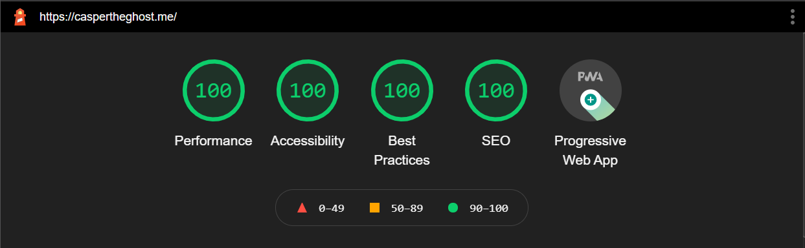

# Portfolio

my portfolio

## Performance

## What I learned

- Better understanding of scss
- Better understanding of next.js
- Better understanding of SEO

Credits: [Dev-CasperTheGhost](https://github.com/Dev-CasperTheGhost)
